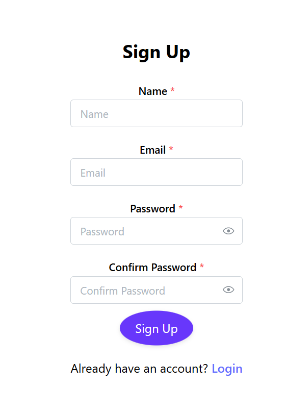

# Login Logout [Form](https://my-soacial-auth.netlify.app/)
This is a simple User Authentication that allows one to access the dashboard.
the user credentials are stored in the local storage to make it easy for him to login once he wants access the dashboard for the second time!!

